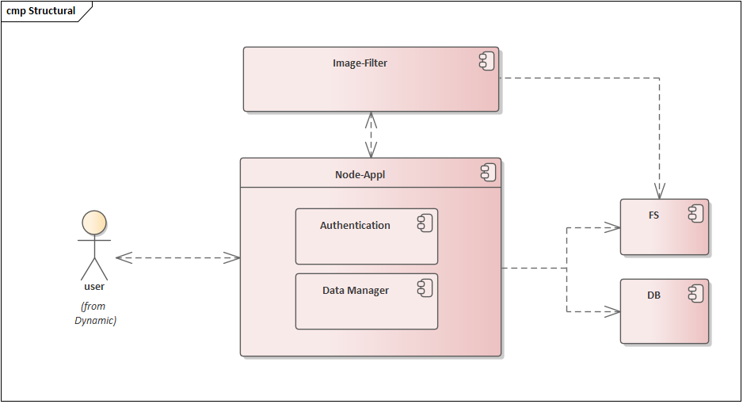
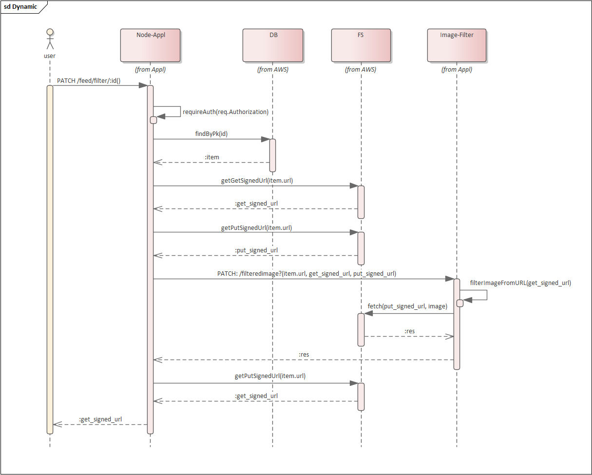

# Udagram Image Filtering Microservice

Udagram is a simple cloud application developed alongside the Udacity Cloud Engineering Nanodegree. It allows users to register and log into a web client, post photos to the feed, and process photos using an image filtering microservice.

The project is split into 2 parts:
1. **The RestAPI Backend**, a Node-Express server which can be deployed to a cloud service (Node-Appl).  
2. **The Image Filtering Microservice**, the final project for the course. It is a Node-Express application which runs a simple script to process images(image-filter).

# System structure

## Example of sequence for image filtering

